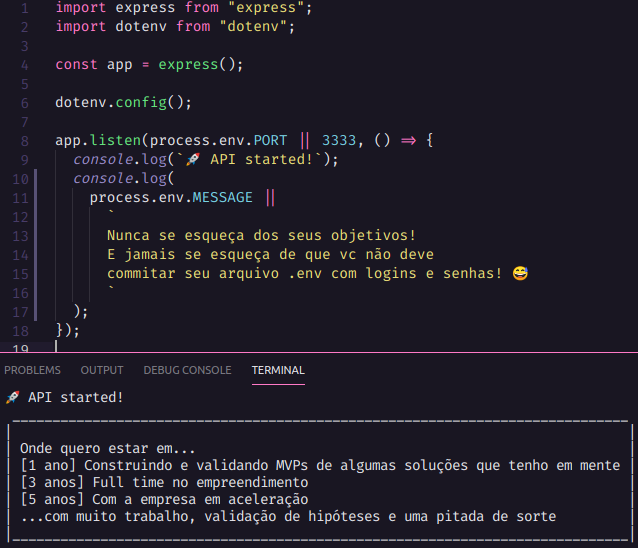

<h3 align="center">
  Expansion Week: Desafio 03
</h3>

<div align="center">
    
</div>

<br>

<p align="center">
  <a href="#sobre">Sobre o desafio</a> | 
  <a href="#tecnologias">Tecnologias</a> | 
  <a href="#run">Rodando o projeto</a> | 
  <a href="#contato">Contato</a>
</p>

<br>

<div align="center">
    
</div>
<br>
<a id="sobre"></a>

## :rocket: Sobre o desafio

Entre os dias 6 e 10 de julho de 2020 acontece a Expansion Week, da <a href="https://rocketseat.com.br/">Rocketseat</a>, com encontros ao vivo com profissionais que passam experiência para os alunos sobre habilidades além da parte técnica.

E neste repositório subi os arquivos para atender o desafio 3: pensar nos meus objetivos e deixar em um local visível para que eu sempre veja onde quero estar em um curto, médio e longo prazos.

E para que eu sempre esteja lembrando dos meus objetivos, minha ideia foi disparar uma mensagem no prompt de comando toda vez que eu subir um servidor em Node.js.

<a id="tecnologias"></a>

## :computer: Tecnologias

O projeto foi desenvolvido utilizando as tecnologias:

- [Node.js]()
- [Express]()
- [dotenv]()

<a id="run"></a>

## :running: Rodando o projeto

1. Pré-requisitos:

- **[Node.js](https://nodejs.org/en/)**, **[Git](https://git-scm.com/)** e um gerenciador de pacotes (**[NPM](https://www.npmjs.com/)** ou **[Yarn](https://yarnpkg.com/)**) instalados na máquina.

2. Clonar o repositório:

```sh
  $ git clone https://github.com/testtzlaffe/expansion-week.git
```

3. Para atualizar a mensagem com seus objetivos: abra o arquivo .env e atualize a MESSAGE

4. Rodar o ambiente de desenvolvimento da aplicação para verificar a mensagem no prompt de comando:

```sh
  # Instalar as bibliotecas e as dependências
  $ npm install (ou yarn)

  # Iniciar o servidor
  $ cd expansion-week
  $ npm run dev (ou yarn dev)
```

<a id="contato"></a>

## :coffee: Contato

<h4>
    Gostou do projeto? Fique a vontade para mandar críticas ou sugestões. Se quiser iniciar um papo, conversar sobre este trabalho ou qualquer outro assunto, me chame no <a href="https://www.linkedin.com/in/christian-testtzlaffe-alpoim/" target="_blank">Linkedin</a>.
</h4>

---

<h4 align="center">
    Feito com 💜 por <a href="https://www.linkedin.com/in/christian-testtzlaffe-alpoim/" target="_blank">Christian Testtzlaffe Alpoim</a>
</h4>
